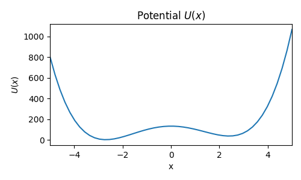
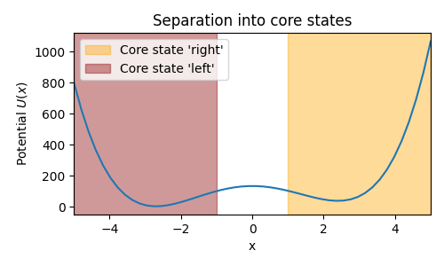

# markovstatemodel

This repository shows the demonstration of a simple Markov State Model. 
The system which is investigated here is inspired by biophysics, though the
project itself is kept quite general.

The problem covered in here is the one-dimensional movement of a particle
in the double well potential shown below.

The system is then split in two core states "left" and "right":

Afterwards, the
dynamics with respect to these two states are investigated in terms of if the 
so defined states yield a valid Markov State Model (MSM).

The code itself is contained in the two files `MSM_simulation.py` and 
`plotting_functions.py`, while the results can be seen in the jupyter notebook 
`markov_state_model.ipynb`. 
The notebook contains some latex equations which are not shown 
correctly when opened on github. So if you want to go through the whole project
you better download at least the jupyter notebook in order to see all the 
markdown cells properly formatted.
